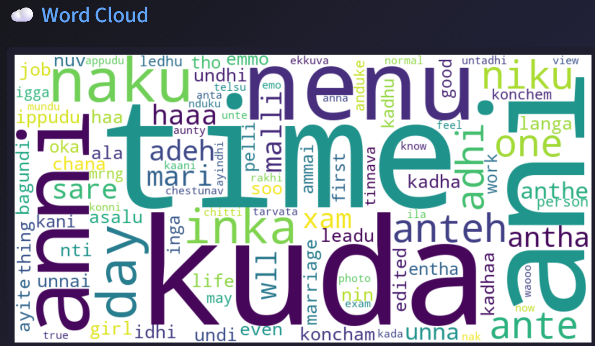
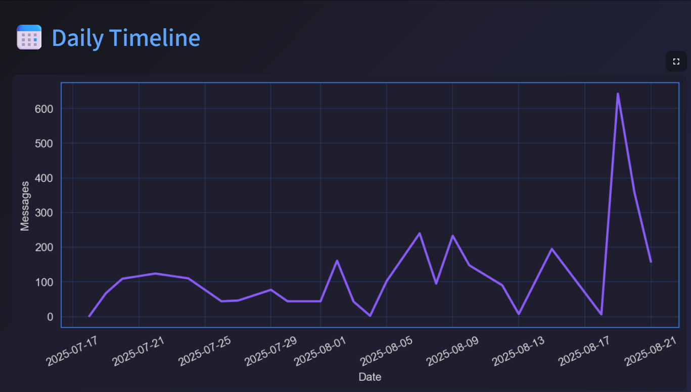

<h1 align="center">💬 WhatsApp Chat Analyser</h1>
<p align="center">
  A powerful tool to analyze exported WhatsApp chats, visualize group dynamics, and extract insightful messaging patterns from your conversations.
</p>

<p align="center">
  
  
  
  
</p>

---

## 🧠 Project Description

This project analyzes raw WhatsApp chat exports (`.txt` format) to uncover trends, participant behavior, and communication patterns. From identifying the most active users to generating emoji usage stats and word clouds, this analyser provides a detailed breakdown of both personal and group conversations.

> 📂 Supports both personal and group chats  
> 🧼 Automatically cleans and processes raw exported data

---

## 📌 Features

- 📅 **Timeline Analysis** – Message frequency over time (daily, monthly, yearly)
- 👤 **Most Active Users** – Detect top contributors in group chats
- ⏰ **Hourly & Weekly Activity** – Peak hours and busiest days of the week
- 🧾 **Message Statistics** – Message count, word count, media shared, links, etc.
- 🌐 **Word Cloud** – Most common words used in the chat
- 😂 **Emoji Analysis** – Frequently used emojis and their counts
- 🗂️ **Media & Link Sharing** – Analyze shared media and URLs
- 🔍 **User-wise Breakdown** – Personalized message stats per participant
- 🧼 **Text Cleaning & Preprocessing** – Handles system messages, timestamps, and formatting

---

## 🖼️ Sample Visualizations

<p align="center">
  
  <br />
  
</p>

---

## 📁 Data Input

- **Source**: Export your WhatsApp chat from the app
  - On WhatsApp: `More Options` → `Export Chat` → Choose without media → Save `.txt` file
- **Format Supported**: `.txt` format (as exported from WhatsApp)

> ⚠️ The exported `.txt` file is **not included** in this repository due to privacy reasons. Please export your own chat file to use the analyser.

---

## 🛠️ Technologies Used

- **Python 3.8+**
- **Pandas** – Data manipulation
- **Matplotlib** & **Seaborn** – Visualizations
- **WordCloud** – Word frequency visualization
- **Emoji** – Emoji parsing and analysis
- **Streamlit** *(optional)* – For building interactive dashboards
- **Jupyter Notebook** – Interactive data analysis

---

## 🚀 Getting Started

### ✅ Prerequisites

Ensure you have:
- Python 3.8 or above
- pip (Python package installer)
- Jupyter Notebook or Streamlit installed

### 📦 Installation

```bash
# Clone the repository
git clone https://github.com/sid/whatsapp-chat-analyser.git

# Navigate into the folder
cd whatsapp-chat-analyser

# (Optional) Create a virtual environment
python -m venv chat_env

# Activate the virtual environment
# Windows
chat_env\Scripts\activate
# macOS/Linux
source chat_env/bin/activate

# Install required packages
pip install -r requirements.txt

# Run the notebook or script
jupyter notebook
# or
streamlit run app.py
